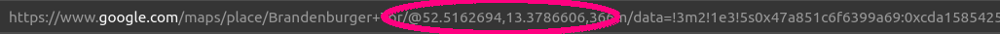

# FlightTracker

[=> DEUTSCH](README_DE.md)

The Flight Tracker is made for educational purposes and is one of the first evolutional tools to track and combine a number of online services on one spot.

It is made to visualize the flight traffic of your local environment and to get information of the flying objects around you. Additionally, optional current weather maps are displayed.


Currently included services are:
 - [FlightRadar24](https://www.flightradar24.com) through the unofficial [FlightRadarAPI](https://github.com/JeanExtreme002/FlightRadarAPI). Please note the [Terms and Conditions](https://www.flightradar24.com/terms-and-conditions)!
 - [Google Maps](https://www.google.com/maps) through generated API-less requests. Please note the [Google Maps Platform Terms of Service](https://cloud.google.com/maps-platform/terms) and [Google Maps/Google Earth Additional Terms of Service](https://www.google.com/intl/en_US/help/terms_maps/)!
 - [wetter.com](https://www.wetter.com/) rain and cloud radar maps through generated API-less requests. Please note the ["Allgemeine Geschäftsbedingungen"](https://www.wetter.com/agb/)! (Service only available in Europa and North America.)

## Installation

For quick test, download the Windows binary as [FlightTracker.zip](https://pheles.de/FlightTracker.zip).

The Flight Tracker is a Python application. To install to your computer, you just need to do:

```
git clone https://github.com/DaPheles/FlightTracker.git <install_path>
```

When the installation is done, change into your install path.

Installation of dependency packages:

```
pip install -r requirements.txt
```

Running FlightTracker:

```
python FlightTracker.py
```

## Configuration

The configuration file *config.ini* is used to modify your home location and appearance of your local neighborhood. By default, the Home location is set to the Berlin Brandenburger Tor.

### Location

Get your home location via [Google Maps](https://www.google.com/maps), click on your preferred location and check the URL of your browser window:



The location is coded in the format ```@<latitude>,<longitude>```. Fill these number in the latitude and longitude fields of your config.ini.

### Locale

If you prefer the maps come with a specific locale naming, e.g. German, set the ```localeLang = de``` and ```localeCountry = DE```, or find the proper locale definition of your preference (refer to the [ISO locale language code table](https://gist.github.com/eddieoz/63d839c8a20ef508cfa4fa9562632a21)).

## Controls

### Keys

```R```: toggles visualization of the rain radar map as overlay (on/off)

```C```: toggles visualization of the cloud map as overlay (on/off)

### Mouse

```Center Mouse Button``` on any plane icon activates the FollowFlight window for a particular flight to follow the flight on the way to its destination.
